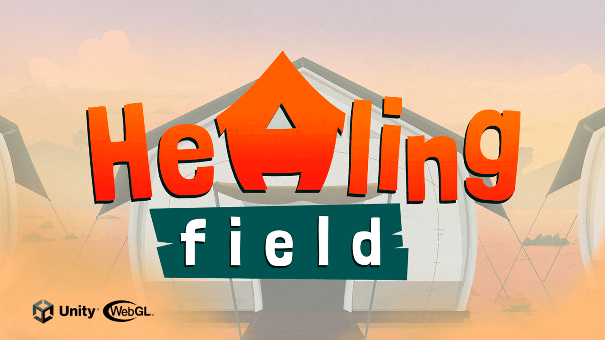

 

Serious Game 2D com foco em divulgar a rotina dos médicos envolvidos no programa Médicos Sem Fronteiras, os quais batalham muito para levarem saúde para todo mundo. Fazendo isto com gerenciamento de recursos.

mais detalhes e download do projeto executável completo em:

https://www.elivelton.dev/healing-field

<h1 align="left"> Contato do Criador: </h1>

email: contato@elivelton.dev

+55 (11) 96274-8359

ou acesse meu site e confira meus outros projetos:

https://www.elivelton.dev

